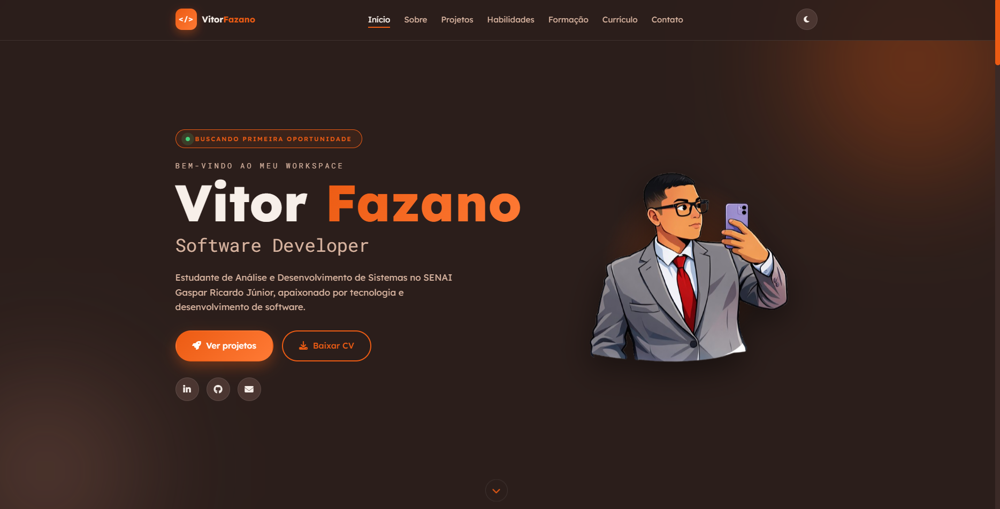

# 🚀 Portfólio Fazano v2.0.0

### Desenvolvedor Full Stack • Vitor Fazano

 

**Um portfólio moderno, responsivo e totalmente desenvolvido com HTML, CSS e JavaScript puro.**

[🌐 Ver Online](https://vfazano.github.io/Portifolio-Fazano/) • [💼 LinkedIn](https://www.linkedin.com/in/vitorfazan0/) • [👨‍💻 GitHub](https://github.com/vfazano)

---

## ✨ Sobre o projeto

O **Portfólio Fazano v2.0** foi desenvolvido para apresentar minhas habilidades, projetos, formação e currículo de forma moderna e intuitiva.

A aplicação foi construída **sem frameworks**, utilizando apenas tecnologias nativas da web, priorizando performance, responsividade e uma excelente experiência para o usuário.

  

---
## Documentação

A documentação completa do projeto está disponível no Wiki do GitHub.

[📚 Acessar a documentação do projeto](https://github.com/vfazano/Portifolio-Fazano/wiki)

## 🛠 Tecnologias utilizadas

| Front-end | Ferramentas |
|-----------|-------------|
| HTML5 | Git |
| CSS3 | GitHub |
| JavaScript (ES6+) | VS Code |
| CSS Variables | Font Awesome |

---

## 🚀 Funcionalidades

- 🌙 Tema claro/escuro com preferência salva
- 📱 Layout totalmente responsivo
- 🎯 Menu fixo com destaque da seção ativa
- ⌨️ Efeito de digitação no Hero
- ✨ Animações ao rolar (Intersection Observer)
- 📊 Contadores e barras de habilidades animadas
- 🗂️ Filtro de projetos por categoria
- 📄 Currículo em PDF incorporado
- 📬 Formulário de contato com validação
- ♿ Suporte a \`prefers-reduced-motion\`

---

## 📂 Estrutura do projeto

\`\`\`
Portifolio-Fazano/
│
├── index.html
├── style.css
├── script.js
│
├── img/
│   ├── perfil.svg
│   ├── desenho_fazano2.png
│   ├── foto_portifolio.png
│   └── ...
│
├── curriculo/
│   └── curriculo-vitor-fazano.pdf
│
└── assets/
    ├── preview.png
    └── demo.gif
\`\`\`

---

## ⚙️ Como executar

Clone o repositório:

\`\`\`bash
git clone https://github.com/vfazano/Portifolio-Fazano.git
\`\`\`

Entre na pasta:

\`\`\`bash
cd Portifolio-Fazano
\`\`\`

Inicie um servidor local:

\`\`\`bash
python -m http.server 8000
\`\`\`

Abra:

\`\`\`
http://localhost:8000
\`\`\`

---

## 🎨 Personalização

| Alteração | Arquivo |
|-----------|---------|
| Foto principal | \`img/Desenho_Fazanosf.png\` |
| Imagem Sobre | \`img/desenho_fazano2.png\` |
| Projetos | \`index.html\` |
| Currículo PDF | \`curriculo/\` |
| Cores do tema | \`style.css\` |
| E-mail do formulário | \`script.js\` |

---

## 📸 Seções do site

- 🏠 Hero
- 👨‍💻 Sobre
- 🚀 Projetos
- 💡 Habilidades
- 🎓 Formação
- 📄 Currículo
- 📬 Contato

---

## 📈 Melhorias da versão 2.0.0

- Interface totalmente redesenhada
- Novo sistema de tema claro/escuro
- Animações mais suaves
- Barra de progresso de rolagem
- Menu mobile em Drawer
- Currículo incorporado em PDF
- Melhor organização do código
- Performance e responsividade aprimoradas

---

## 👨‍💻 Autor

### Vitor Fazano

Desenvolvedor Full Stack em formação

---

⭐ Se este projeto te inspirou, deixe uma estrela no repositório!

